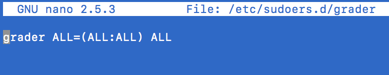

# Amazon Lightsail Setup

[Seoul Server]
1. Sign up for a Amazon Web Services Lightsail Account
https://aws.amazon.com/
2. Sign into AWS Console

3. Private IP = 172.26.1.169

   Public IP = 52.78.37.166
   
   Host Name = ec2-52-78-37-166.ap-northeast-2.compute.amazonaws.com

   Get the hostname from http://www.hcidata.info/host2ip.cgi

4. Download SSH Keypairs

5. Add TCP Ports

6. Now we are finished with the Amazon Lightsail Setup! 

# Linux Server Configuration Part I

1. Show all files in Mac OSX by typing `$ killall Finder` in the terminal. 
2. Input in terminal `$ defaults write com.apple.finder AppleShowAllFiles TRUE`. 
3. Locate the hidden .ssh folder in the root of your Mac.
4. Move the downloaded `.pem` file into your `.ssh` folder.

5. Rename the `.pem` file to `udacity.pem`
6. To make the public key usable and secure, go back to your terminal and input `$ chmod 600 ~/.ssh/udacity.pem`
7. Log into Amazon Lightsail Server with `$ ssh -i ~/.ssh/udacity.pem ubuntu@52.78.37.166`
8. Type `$ sudo su -` to become a root user. 
9. Type  `$ sudo adduser grader` to create a user 'grader' 
10. Enter `grader` UNIX password as `udacity`

11. Create a new file under the sudoers directory: `$ sudo nano /etc/sudoers.d/grader`.
12. Fill that file with `grader ALL=(ALL:ALL) ALL` using nano and save it.

13. In order to prevent the `$ sudo: unable to resolve host error`, edit the hosts by `$ sudo nano /etc/hosts`, and then add `127.0.1.1 ip-10-20-37-65` under `127.0.1.1:localhost`
14. Run `$ sudo apt-get update`
15. Run `$ sudo apt-get upgrade`
16. Run `$ sudo apt-get install finger`

# Linux Server Configuration Part II
1. Open up a new terminal window. Type `$ ssh-keygen -f ~/.ssh/udacity_key.rsa`
2. Keep a blank password
3. In the new terminal window (the one just opened up with instructions above), input `$ cat ~/.ssh/udacity_key.rsa.pub`
4. Copy the RSA key and save it somewhere private.

# Linux Server Configuration Part III
1. Return to the terminal window that is logged into root. Change directory to `$ cd /home/grader`
2. Create a .ssh directory: `$ mkdir .ssh`. Check directory with `$ ls -al` You should see a .ssh folder.
3. Create a file to store the public key with `$ touch .ssh/authorized_keys`
4. Edit the authorized_keys file `$ nano .ssh/authorized_keys` and paste the RSA key from Part II
5. Change the permission: `$ sudo chmod 700 /home/grader/.ssh` and `$ sudo chmod 644 /home/grader/.ssh/authorized_keys`
6. Change the owner from root to grader: `$ sudo chown -R grader:grader /home/grader/.ssh`
7. Restart the ssh service: `$ sudo service ssh restart`
8. We now need to enforce the key-based authentication: `$ sudo nano /etc/ssh/sshd_config`. Find the `PasswordAuthentication` line and change text after to `no`. After this, restart ssh again: `$ sudo service ssh restart`
9. We now need to change the ssh port from 22 to 2200, as required by Udacity: `$ sudo nano /etc/ssh/ssdh_config` Find the Port line and change 22 to 2200. Restart ssh: `$ sudo service ssh restart`

# Linux Server Configuration Part IV
1. Log into the server as grader: `$ ssh -i ~/.ssh/udacity_key.rsa -p 2200 grader@52.78.37.166`

2. Disable ssh login for root user: `$ sudo nano /etc/ssh/sshd_config`. Find the `PermitRootLogin` line and edit to `no`. 
3. Restart ssh `$ sudo service ssh restart`
4. Now we need to configure UFW to fulfill the requirement:

* `$ sudo ufw allow 2200/tcp`
* `$ sudo ufw allow 80/tcp`
* `$ sudo ufw allow 123/udp`
* `$ sudo ufw enable`
5. Exit Terminal and take a break.

# Deploying an Application
1. SSH into machine using `$ ssh -i ~/.ssh/udacity_key.rsa grader@52.78.37.166`
2. 

Resource Links:
https://github.com/callforsky/udacity-linux-configuration

