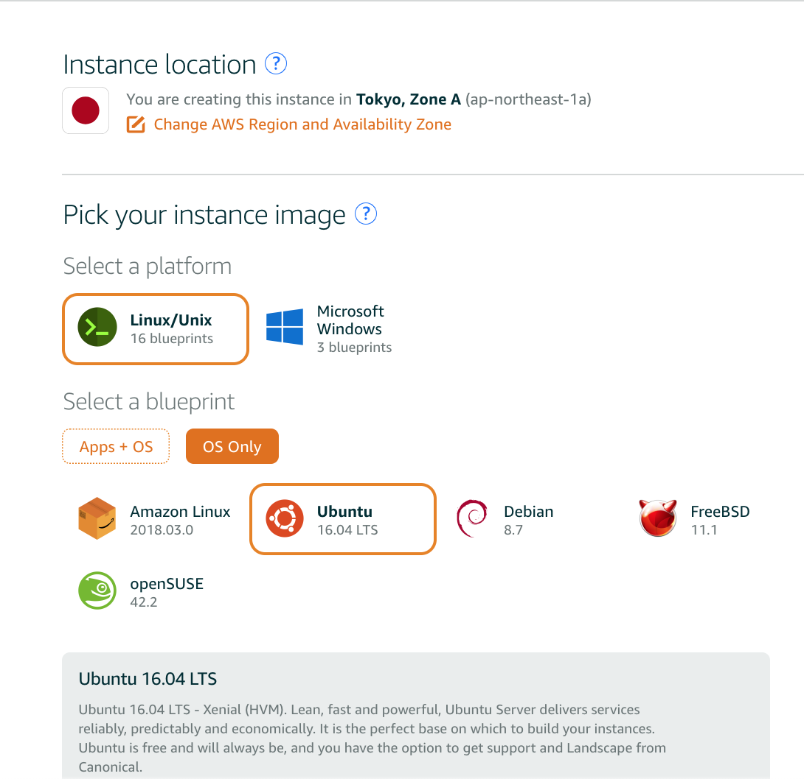
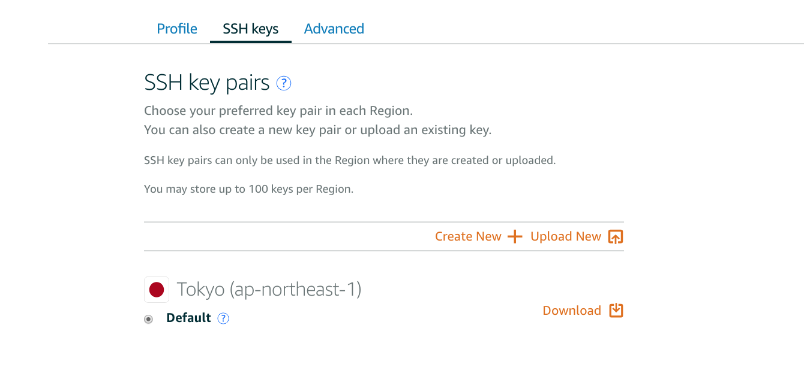
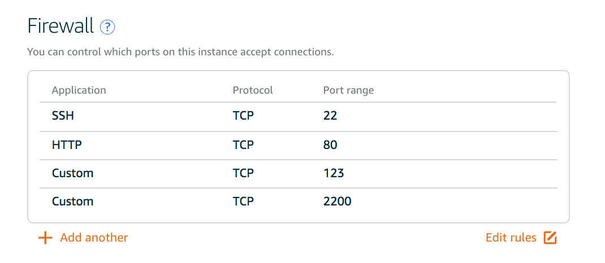
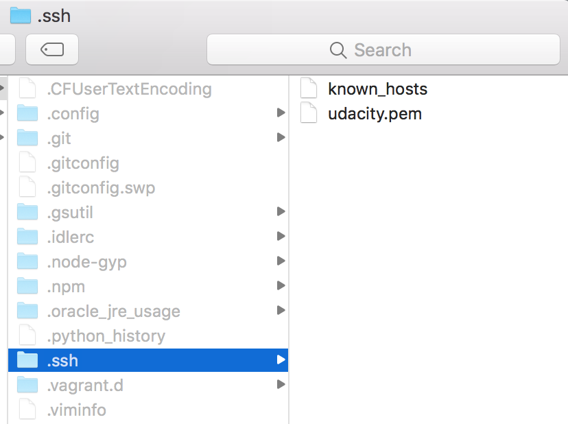

# Amazon Lightsail Setup

1. Sign up for a Amazon Web Services Lightsail Account
https://aws.amazon.com/
2. Sign into AWS Console

3. Private IP = 172.26.1.41

   Public IP = 52.194.229.119
   
   Host Name = ec2-52-194-229-119.ap-northeast-1.compute.amazonaws.com

   Get the hostname from http://www.hcidata.info/host2ip.cgi

4. Download SSH Keypairs

5. Add TCP Ports

6. Now we are finished with the Amazon Lightsail Setup! 

# Linux Server Configuration

1. Show all files in Mac OSX by typing `$ killall Finder` in the terminal. 
2. Input in terminal `$ defaults write com.apple.finder AppleShowAllFiles TRUE`. 
3. Locate the hidden .ssh folder in the root of your Mac.
4. Move the downloaded `.pem` file into your `.ssh` folder.

5. Rename the `.pem` file to `udacity.pem`
6. To make the public key usable and secure, go back to your terminal and input `$ chmod 600 ~/.ssh/udacity.pem`
7. Log into Amazon Lightsail Server with `$ ssh -i ~/.ssh/udacity.pem ubuntu@52.194.229.119`
8. Run `$ sudo apt-get update`
9. Run `$ sudo apt-get upgrade`
10. Run `$ sudo apt-get install finger`
11. 

Resource Links:
https://github.com/callforsky/udacity-linux-configuration